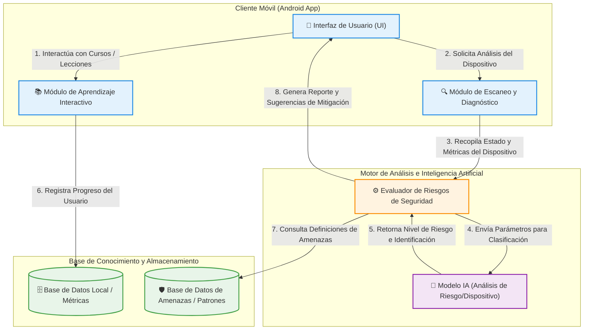

```mermaid
graph TD
    classDef mobile fill:#E3F2FD,stroke:#1E88E5,stroke-width:2px;
    classDef core fill:#FFF3E0,stroke:#FB8C00,stroke-width:2px;
    classDef ai fill:#F3E5F5,stroke:#8E24AA,stroke-width:2px;
    classDef sec fill:#E8F5E9,stroke:#43A047,stroke-width:2px;

    %% Módulos del Sistema E.L.I.
    subgraph "Cliente Móvil (Android App)"
        UI["📱 Interfaz de Usuario (UI)"]
        LearningMod["📚 Módulo de Aprendizaje Interactivo"]
        ScanMod["🔍 Módulo de Escaneo y Diagnóstico"]
    end

    subgraph "Motor de Análisis e Inteligencia Artificial"
        RiskEngine["⚙️ Evaluador de Riesgos de Seguridad"]
        AIModel["🤖 Modelo IA (Análisis de Riesgo/Dispositivo)"]
    end

    subgraph "Base de Conocimiento y Almacenamiento"
        DB[("🗄️ Base de Datos Local / Métricas")]
        ThreatDB[("🛡️ Base de Datos de Amenazas / Patrones")]
    end

    %% Flujos de Información
    UI -->|"1. Interactúa con Cursos / Lecciones"| LearningMod
    UI -->|"2. Solicita Análisis del Dispositivo"| ScanMod

    ScanMod -->|"3. Recopila Estado y Métricas del Dispositivo"| RiskEngine
    RiskEngine -->|"4. Envía Parámetros para Clasificación"| AIModel
    AIModel -->|"5. Retorna Nivel de Riesgo e Identificación"| RiskEngine

    LearningMod -->|"6. Registra Progreso del Usuario"| DB
    RiskEngine -->|"7. Consulta Definiciones de Amenazas"| ThreatDB
    RiskEngine -->|"8. Genera Reporte y Sugerencias de Mitigación"| UI

    %% Aplicar Estilos
    class UI,LearningMod,ScanMod mobile;
    class RiskEngine core;
    class AIModel ai;
    class DB,ThreatDB sec;
```